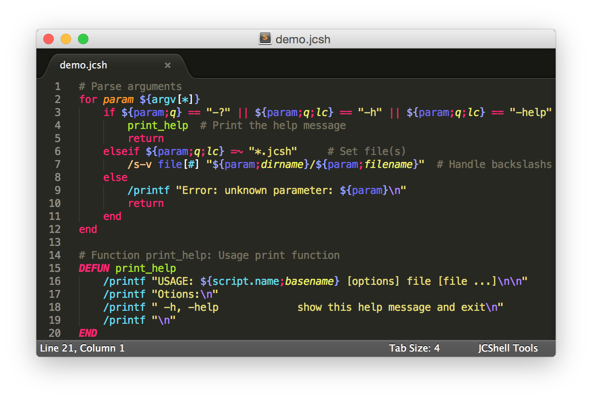
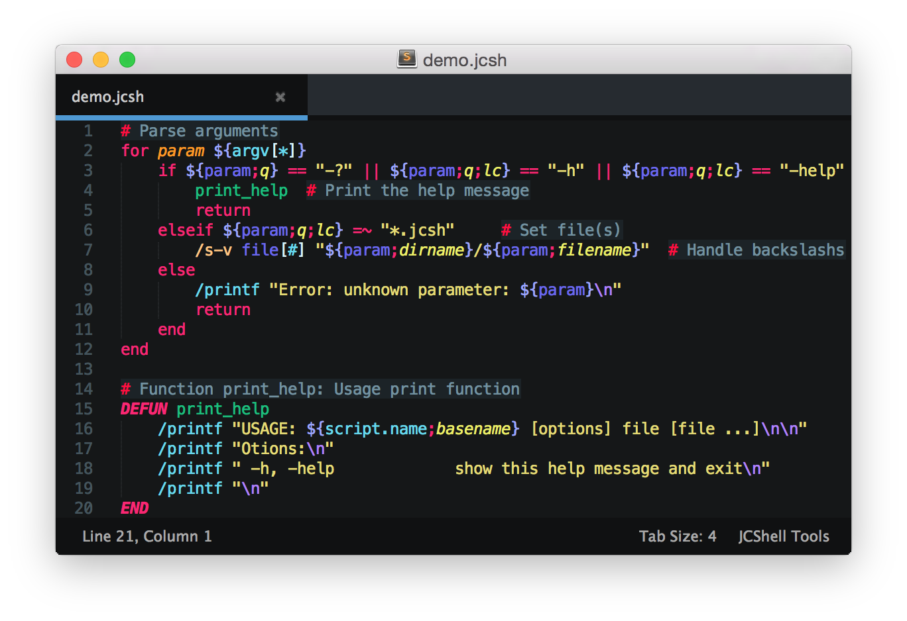

JCShell Tools
=============

Language definition for NXP's JCShell scripts for Sublime Text 2/3.
Contains syntax highlighting, snippets and auto-completion.

## Screenshots

Two color scheme are provided. The default Monokai:

And Seti_UX (for [Seti theme](https://github.com/ctf0/Seti_ST3)):


## Installation

#### Automatically via Package Control

The preferred and easiest way to install the package for Sublime Text is the
following:

1. Install [Package Control](https://sublime.wbond.net/installation) if not done already
2. Open `Tools` → `Command Palette...` (Shift+Ctrl|Super+P)
3. Select `Package Control: Install Package`
4. Search for `JCShell Tools` package and install it

#### Manual installation

If you want to do the installation manually (for example on an offline computer):

1. Clone (or [download](archive/master.zip)) this repository
2. Open your `Packages` folder (`Preferences: Browse Packages` in the Command Palette)
3. Create a folder `JCShell Tools` and copy the repository content inside

#### Configuration

You can change the default color scheme for `.jcsh` files. For that create a new file `JCShell Tools.sublime-settings` inside your User folder (`Packages/User`) and set the desired `color_scheme` value.
For example if you want to use the provided Seti_UX color scheme the file should contains:
```
{
    "color_scheme": "Packages/JCShell Tools/Seti_UX JCShell Tools.tmTheme"
}
```

## Custom color scheme

If you want to add support in a different color scheme the following supplementary scopes needs to be defined:

- `variable.other`
- `string.unquoted`
- `keyword.control.label`
- `keyword.function.definition`
- `keyword.modifier.variable`
- `punctuation.definition.variable.reference`
- `keyword.assignment`

You can see the [Monokai JCShell Tools.tmTheme](Monokai JCShell Tools.tmTheme#L10) file for example values.

## Known limitations

Even though the following syntaxes are valid, JCShell Tools is not accepting it:
    
- When a function/script name contains a closing parenthese (`)`)
- When a variable assignment made by operator (`=`) contains a space or a quote (e.g.: `test$(func param)var= value`)

## About

Licensed under the BSD 3-Clause license. See [license file](LICENSE) for more information.

Developed by @Mikaz-Fr, based on a draft from Connor Röhricht.

Please create an [issue](https://github.com/NXP/JCShell-Tools/issues) for any bug you may find.
